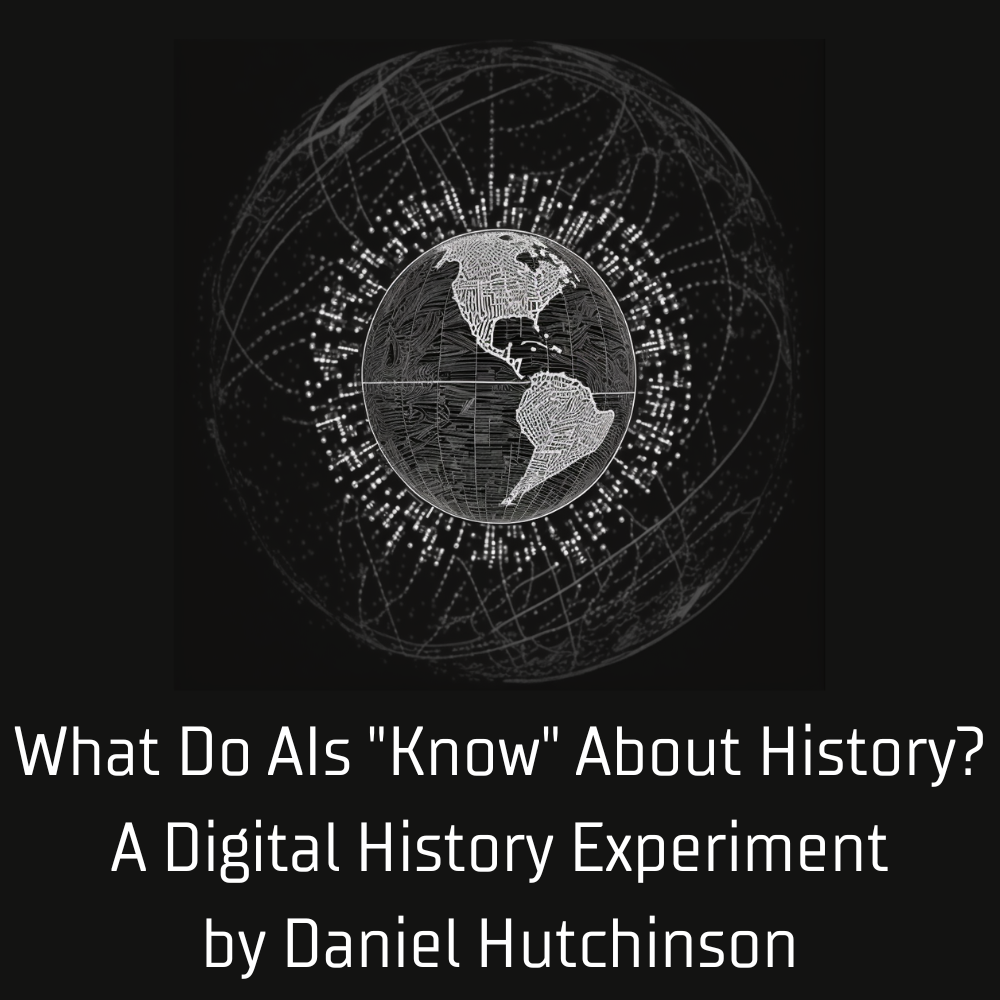

# What Do AI's Know About History? A Digital History Experiment

## Contents

- [Project Description](#summary)
- [Project Elements](#project_elements)
- [Project Goals](#project_goals)
- [Methods](#methods)
- [Acknowledgements](#acknowledgements)
- [License](#license)

## Project Description

This digital history experiment examines the following question: what do AIs know about history? AIs don't 'know' anything really. But recent advances in machine learning have resulted in new computational models capable of remarkable imitation of human analytical capabilities. Among the most studied of these models is GPT-3 (Generative Pre-trained Transformer-3). In this digital history experiment, users can pose historical questions to GPT-3 and observe its responses. This project enables historians and the public to directly probe the historical capacities of advanced AIs, and gauge for themselves the possibilities and perils of this technology. With such knowledge, we can better assess AI’s potential impact on understanding of the past, and consider the broader implications of this technology for the future.

## Project Elements

1. What Does an AI “Know” about A.P. History?: In this section, humans can test their historical knowledge against that of an AI. Users can answer multiple choice questions from the Advanced Placement (A.P.) curriculums for U.S., European, and World history, and then compare their performance against GPT-3. Accompanying these questions is data on GPT-3's overall performance on these questions.
2. How Does an AI “Interpret” a Primary Source?: Here users can prompt GPT-3 to analyze and interpret a selection of primary sources. GPT-3 will attempt to offer the source’s context, purpose, intended audience, and possible historiographical interpretations of the source.
3. Can an AI Simulate a Historical Worldview?: In this section users can pose questions to an AI instructed to imitate a figure from history: Francis Bacon (1561-1626), former Lord Chancellor of England under Queen Elizabeth I and King James I, and a key figure in the Scientific Revolution.
4. Project Goals, Methods, and Acknowledgements: Explores the aims of this project, some of the methods used, and thanks those who contributed to this project.

## Project Goals

This digital history experiment explores the potential of AI applications for both academic research and as a force for disinformation. The project uses OpenAI's GPT-3 model as a case study due to its accessibility and position as the subject of robust scientific study and debate.

In May 2022, the initial findings from this project were presented to the [Digital History Working Group for the Consortium For History of Science, Technology, And Medicine.](https://www.chstm.org/content/digital-history) The findings are expanded upon in an academic paper currently under peer review.

## Methods

The project employs Streamlit to run Python scripts calling OpenAI's API for GPT-3. GPT-3's outputs are products of specialized prompts informed by current research in prompt engineering. Specific methods include few shot prompting and chain-of-thought reasoning. The project's GitHub repository contains the full text of these prompts.

## Acknowledgements

Many thanks to Abraham Gibson for the invitation to the CHSTM's Digital History Working Group to share this research, and to colleagues William Mattingly, Patrick Wadden, and Ian Crowe for their thoughtful feedback.

This project was supported by a sabbatical semester awarded by the Office of Academic Affairs at Belmont Abbey College. Gratitude is extended to Provost Travis Feezell and Vice Provost David Williams for their support of this effort.
